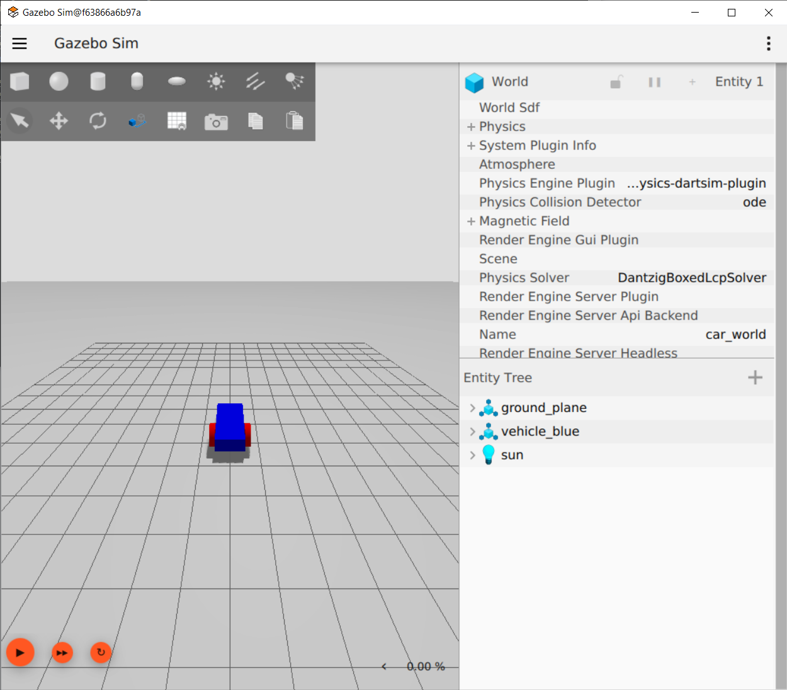

# Getting Started With Gazebo Harmonic

**Gazebo Harmonic** 
Gazebo is one of the mainstream robotics simulation softwares that is used to test your projects before deploying them in the real world. Gazebo Harmonic is the latest version in a long line of verisons that features better UI, easier ROS2 integration and a library full of models ready to import in to your world.

### This tutorial will teach you how to build and move a custom robot in Gazebo Harmonic
- Gazebo Harmonic is automatically installed within the dockerfile that you have already built. To test that it is working property you can run the command `gz sim`. You should see the word ***Harmonic*** in the top right corner when the window loads

- ***If for some reason it is not installed, you can follow the steps [here](https://gazebosim.org/docs/harmonic/install) to install it***
- Start by creating a new workspace. We can name it something like `limo_ws` for now. Create a src folder within your workspace and then use colcon build. Within your src folder create a ros2 package using the flag –build-type ament_cmake instead of ament_python
- Next you can follow the official [tutorial](https://gazebosim.org/docs/harmonic/building_robot) by creating a file called building_robot.sdf
    - You can also find the completed SDF file in this git repository
- Next you can follow the next step in the [tutorial](https://gazebosim.org/docs/harmonic/moving_robot) by clicking `Moving The Robot` on the left hand side

- By the end of this tutorial, your robot should look just like this: 

## **Extra Credit**
- If you would like to recieve extra credit for this assignment, you can navigate to [this tutorial](https://gazebosim.org/docs/harmonic/fuel_insert) and follow along there. If you can import and control one of these robots successfully and show it to your TA, you will recieve _______
