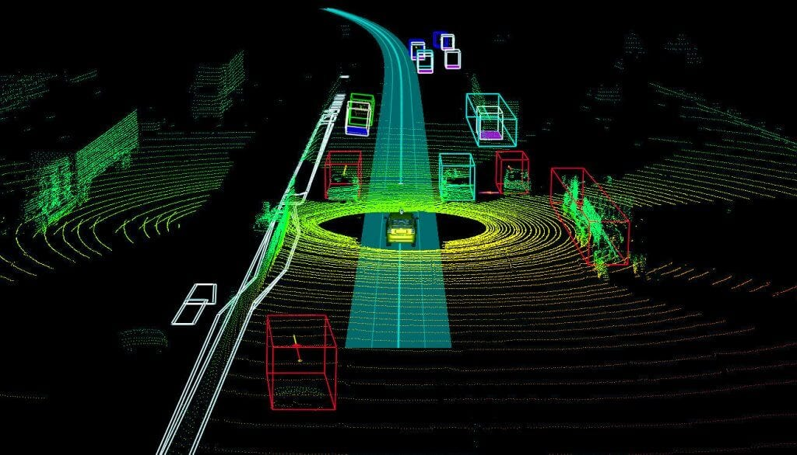
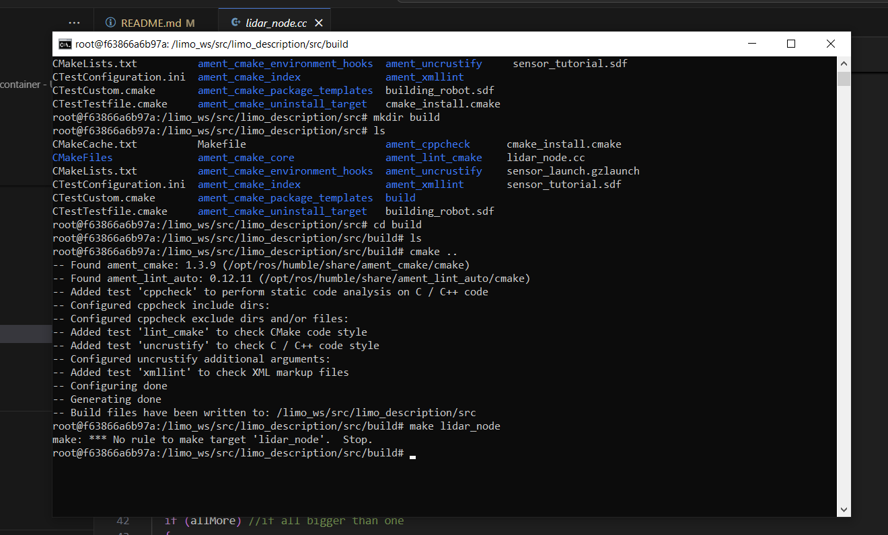
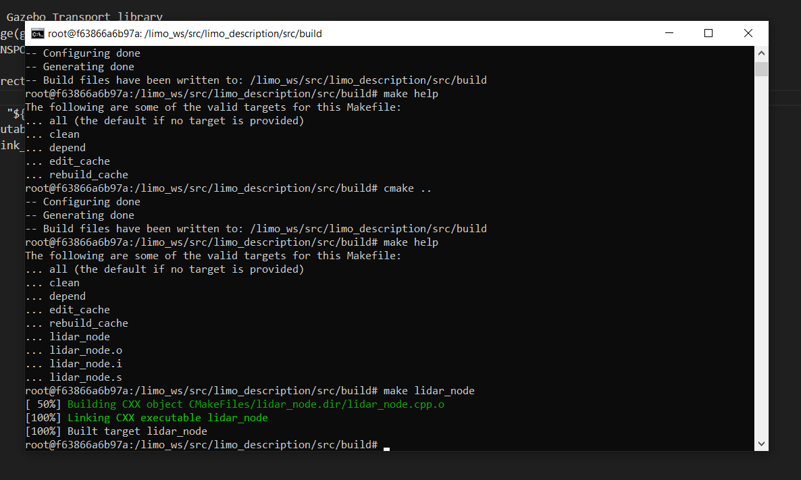

# Sensors and Data Acquisition

Imagine being placed in the middle of a an unknown desert. You're left without the sight from your eyes, sound from the environment, and your sense of touch to feel the ground. You want to leave the desert but you have absolutely no idea where to even begin. 

This is a similar scenario for a robot that doesn't have sensors. Robots use a host of different sensors such as **cameras**, **Lidar**, **IMUs** ***(Inertial Measurement Units)*** **radar** and more. Though a robot can operate with only one of these sensors, combining many or all of them can lead to some powerful applications. Sensors are crucial for more complex aplications like self-driving. Imagine a Tesla trying to find its way through a city without cameras. 

You may be asking yourself, how do these sensors communicate with the robot? If the robot sees a person how does it know to stop. This is all through the communication of data (Typically CAN bus or ros2 components). Lidar for example is a very intuative way to map an environment. Lidar can be 2D or 3D and it is composed of a lot of data points in vectors. We can visualize this data with something called a point cloud (see image below). You can think of the way that Lidar works to be similar to how bats use echo location. As a robot navigates around an environment, the more it can see, and therefore the more pieces of a map it can put together. 

# Activity
- In this activity you will add several sensors to your moving robot in gazebo to allow it to detect how close it is, or whether it has hit an object or not. This is helpful to prevent damage and danger accosiated with robotics. By the end of this lesson you should have a simulation of a robot that can detect if it's getting too close to a wall and turn to the left so that robot avoids it

## Setup:
- Open an instance of a docker container. 
- Navigate to your `limo_ws` workspace, to the same directory where you have the building_robot.sdf
- Create three new files: A copy of the building_robot.sdf, lidar_node.cpp, and sensor_launch.gzlaunch

## Tutorial

Navigate to the Gazebo Harmonic [official sensor tutorial](https://gazebosim.org/docs/harmonic/sensors) and follow the necessary steps to add an IMU (Inertial Measurement Unit) sensor, Contact sensor, and Lidar sensor. Once you have finished, show your TA to get checked off.

This tutorial will guide you through updating a copy of the building_robot.sdf file called sensor_tutorial.sdf. You will create a C++ ROS node for the Lidar sensor, and lastly you will create a gazebo launch file so that you only need to run one file to activate everything you need to make the demo run properly. 
- If you get stuck with writing any code, this github repository will have the final solutions.

**Debugging** 
- CMake is very fragile. Sometimes you need to perform a list of troublshooting strategies to find the solution to a problem with it. After trying to **'make lidar_node'** and recieving the following error message:  delete the ***Build*** folder using the command `rm -rf build` and re-create it. Copy the CMakeLists.txt **EXACTLY** from **THIS** repository, then try the steps again. You should see the output: 
- Use the command `make help` and ensure that you see lidar_node listed as a target. If you do not, there is most likely an issue with the CMakeLists.txt file.

